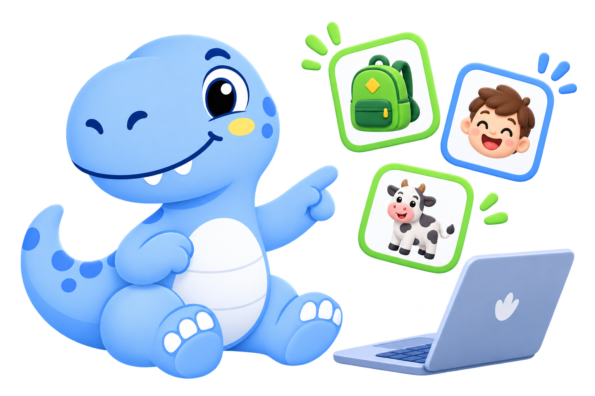
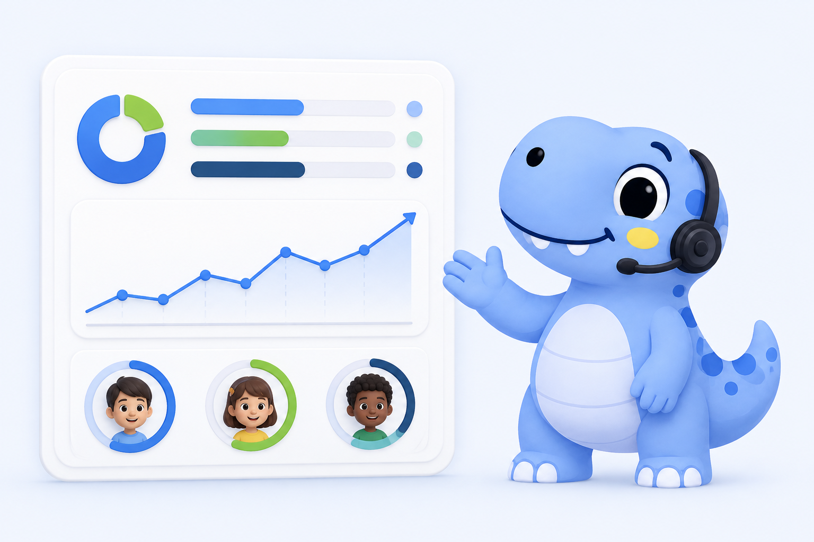
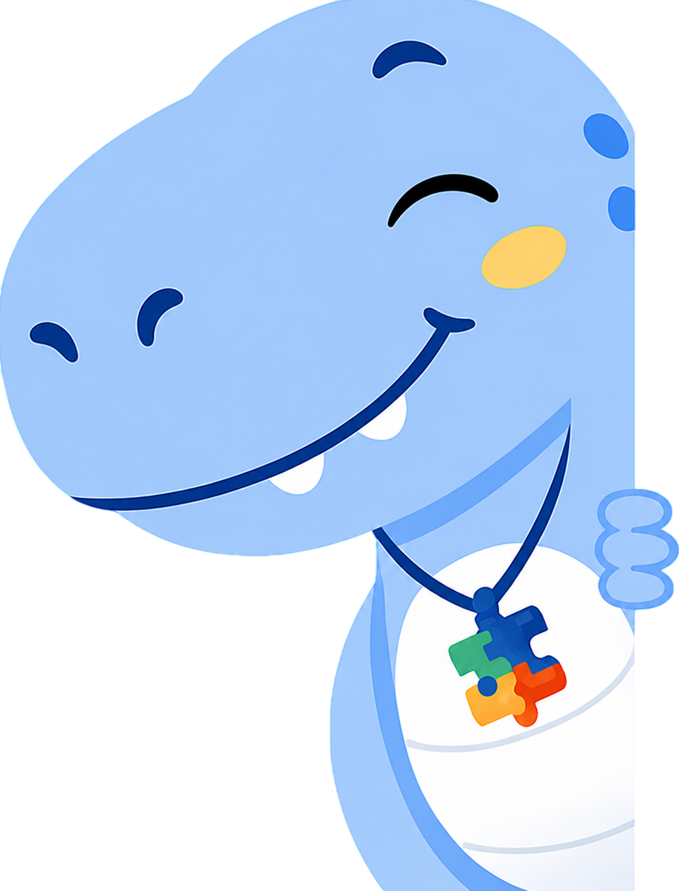

<div align="center">

  

  # 🦖 ROAR — English for All Voices

  <p align="center">
    <strong>Plataforma educacional adaptativa e inclusiva para o ensino de língua inglesa</strong><br>
    <em>Projetada com carinho para pessoas neurodivergentes e estudantes com diferentes necessidades de aprendizagem.</em>
  </p>

  <p align="center">
    <a href="#-sobre-o-projeto">Sobre</a> •
    <a href="#-conheça-o-lex-nosso-mascote">Conheça o Lex</a> •
    <a href="#-galeria-visual-do-projeto">Galeria Visual</a> •
    <a href="#-sistema-de-níveis-de-autonomia">Níveis de Autonomia</a> •
    <a href="#-jornadas-da-plataforma">Jornadas</a> •
    <a href="#-arquitetura-e-tecnologias">Arquitetura</a> •
    <a href="#-como-executar">Como Executar</a> •
    <a href="#-equipe-e-créditos">Créditos</a>
  </p>

  <p align="center">
    
    
    
    
    
    
  </p>

  <br>

  

  <p><em>"Olá! Eu sou o <strong>Lex</strong>, seu companheiro de aventuras no aprendizado do inglês! 🌿🦖"</em></p>

</div>

---

## 📖 Sumário

- [💡 Sobre o Projeto](#-sobre-o-projeto)
- [🦖 Conheça o Lex: Nosso Mascote Facilitador](#-conheça-o-lex-nosso-mascote-facilitador)
- [✨ Pilares de Inclusão e Neuroacessibilidade](#-pilares-de-inclusão-e-neuroacessibilidade)
- [🧠 Sistema de Níveis de Autonomia](#-sistema-de-níveis-de-autonomia)
- [📸 Galeria Visual do Projeto](#-galeria-visual-do-projeto)
- [🚀 Jornadas da Plataforma](#-jornadas-da-plataforma)
  - [🎒 Jornada do Aluno](#-jornada-do-aluno)
  - [👩‍🏫 Jornada do Professor / Gestão Escolar](#-jornada-do-professor--gestão-escolar)
- [🏗️ Arquitetura e Engenharia de Frontend](#-arquitetura-e-engenharia-de-frontend)
- [📂 Estrutura de Diretórios](#-estrutura-de-diretórios)
- [⚡ Como Executar Localmente](#-como-executar-localmente)
- [⚙️ Configurações & Alternância Mocks / API](#️-configurações--alternância-mocks--api)
- [🧪 Ferramentas de Validação e Qualidade](#-ferramentas-de-validação-e-qualidade)
- [👥 Equipe e Créditos](#-equipe-e-créditos)

---

## 💡 Sobre o Projeto

O **ROAR** (*English for All Voices*) é um ecossistema educacional de aprendizagem de inglês criado para **romper barreiras pedagógicas tradicionais**. Desenvolvido como Trabalho de Conclusão de Curso (TCC), o projeto coloca no centro estudantes neurodivergentes (incluindo pessoas no espectro autista, TDAH, dislexia e outras peculiaridades no processamento cognitivo).

### 🎯 Por que a ROAR é diferente?

- 🚫 **Zero Pressão e Ansiedade:** Sem contadores regressivos, sem punição por erro e com tentativas ilimitadas. O ritmo é determinado pelo aluno.
- 🧩 **Multimodalidade Real:** Conteúdo assimilado através de estímulos visuais limpos (fotos reais e ilustrações vetoriais), comandos e reforço em áudio, além de interações táteis/motoras diretas.
- 📐 **Previsibilidade Cognitiva:** Estrutura de interface consistente, sem transições abruptas ou sobrecarga sensorial (*sensory overload*).
- 🤝 **Ponte Aluno-Professor:** Conecta a experiência acolhedora do estudante com um dashboard analítico poderoso para o corpo docente.

---

## 🦖 Conheça o Lex: Nosso Mascote Facilitador

O **Lex** não é apenas uma ilustração fofa; ele é um **agente facilitador cognitivo e de afeto** que acompanha o usuário em cada interação. 

<div align="center">
  <table>
    <tr>
      <td align="center" width="33%">
        <br>
        <strong>Guia de Aprendizagem</strong><br>
        <sub>Apresenta palavras, lê instruções com calma e comemora acertos.</sub>
      </td>
      <td align="center" width="33%">
        <br>
        <strong>Parceiro do Professor</strong><br>
        <sub>Traduz métricas pedagógicas e apoia a tomada de decisão com evidências.</sub>
      </td>
      <td align="center" width="33%">
        <br>
        <strong>Abridor de Portas</strong><br>
        <sub>Incentiva a autonomia e abre caminhos para um futuro bilíngue.</sub>
      </td>
    </tr>
  </table>
</div>

### 🎨 O Papel do Lex na Neuroinclusão:
1. **Âncora de Segurança:** A presença constante do Lex reduz o medo de errar e promove segurança emocional.
2. **Microinterações Expressivas:** Nas telas de login e senha, o Lex reage visualmente (olhando atentamente, espiando ou protegendo o campo com as patinhas), transformando momentos burocráticos em experiências lúdicas.
3. **Reforço Positivo:** O Lex oferece feedbacks afetuosos e estimulantes que reforçam a autoestima e a persistência na tarefa.

---

## ✨ Pilares de Inclusão e Neuroacessibilidade

```
 ┌────────────────────────────────────────────────────────────────────────┐
 │                      PILARES PEDAGÓGICOS ROAR                          │
 ├───────────────────┬─────────────────────┬──────────────────────────────┤
 │  🎯 PREVISIBILIDADE│  👀 CLAREZA VISUAL  │  🔊 SUPORTE MULTIMODAL       │
 │  Layout estável,  │  Imagens reais,     │  Voz sintetizada e áudios    │
 │  sem elementos    │  alto contraste e   │  claros com reforço auditivo │
 │  distratores.     │  tipografia limpa.  │  e tátil imediato.           │
 └───────────────────┴─────────────────────┴──────────────────────────────┘
```

- **Paleta de Cores Terapêutica:** Verde menta suave (`#44f698`), tons de azul tranquilizantes (`#28599a`, `#85c7f2`) e superfícies que minimizam fadiga visual.
- **Tipografia Acessível:** Família tipográfica *Poppins* com hierarquia semântica rigorosa.
- **Autonomia Gradual:** Transição suave entre suporte sensorial puro e validação independente.

---

## 🧠 Sistema de Níveis de Autonomia

O sistema de atividades da ROAR opera sobre um **motor pedagógico trifásico**, personalizando a apresentação, a quantidade de apoio e o tipo de interação conforme o nível do estudante:

| Dimensão | Nível 1: Suporte Visual Puro | Nível 2: Aprendiz Guiado | Nível 3: Autonomia Contextual |
| :--- | :--- | :--- | :--- |
| **Etapa 1: Reconhecer** *(Input Sensorial)* | Palavra isolada em caixa alta, foto real com fundo limpo, áudio automático com voz do Lex e toque único na imagem. | Frase linear curta (S+V+O), ilustração vetorial limpa, comando de áudio e clique para revelar a palavra. | Pequeno parágrafo ou diálogo de rotina, ilustração com contexto visual e leitura autônoma inicial. |
| **Etapa 2: Associar** *(Manipulação Ativa)* | Objeto real com silhueta indicativa, áudio repetido ao arrastar e alvos ampliados com tolerância motora (*drag & drop* facilitado). | Palavra isolada para arrastar até a imagem correspondente, com Lex narrando o progresso da montagem. | Blocos de palavras embaralhadas para ordenação de frases completas (*syntax building*). |
| **Etapa 3: Validar** *(Output Funcional)* | Escolha binária entre 2 fotos reais distintas, pergunta falada pelo Lex (*"Cat"*) e toque direto na resposta. | Associação entre colunas ou seleção de botão com opções de palavras curtas e ilustrações vetoriais. | Múltipla escolha interpretativa ou digitação guiada sem suporte auditivo prévio (avaliação de retenção). |

---

## 📸 Galeria Visual do Projeto

### 🔐 Telas de Acesso com Mascote Interativo

<div align="center">
  <table>
    <tr>
      <td width="50%" align="center">
        <br>
        <strong>Tela de Login Acessível</strong><br>
        <sub>Acesso simples com PIN para alunos e e-mail/senha para educadores.</sub>
      </td>
      <td width="50%" align="center">
        <br>
        <strong>Tela de Cadastro do Educador</strong><br>
        <sub>Fluxo limpo com validações visuais amigáveis e feedback em tempo real.</sub>
      </td>
    </tr>
  </table>
</div>

### 🎨 Detalhes do Mascote Lex em Ação

<div align="center">
  <table>
    <tr>
      <td align="center" width="25%">
        <br>
        <sub><em>"Espiando..."</em></sub>
      </td>
      <td align="center" width="25%">
        <br>
        <sub><em>"Não estou olhando a senha!"</em></sub>
      </td>
      <td align="center" width="25%">
        <br>
        <sub><em>"Vamos praticar?"</em></sub>
      </td>
      <td align="center" width="25%">
        <br>
        <sub><em>"Você consegue!"</em></sub>
      </td>
    </tr>
  </table>
</div>

---

## 🚀 Jornadas da Plataforma

### 🎒 Jornada do Aluno
- **Início Personalizado:** Boas-vindas personalizadas com o Lex, visualização do progresso contínuo e atalhos rápidos.
- **Catálogo de Módulos:** Módulos temáticos intuitivos (ex: *Corpo Humano*, *Animais da Fazenda*). O aluno é direcionado automaticamente para a etapa exata em que parou.
- **Motor Unificado de Atividades (`atividade.html`):** Uma única rota dinâmica carrega todo o fluxo de aprendizado com transições de tela fluidas e seguras.
- **Gamificação Positiva:** Área de **Conquistas** com medalhas e troféus que celebram a consistência e dedicação do estudante, além de telas de **Missões** e **Desempenho**.
- **Perfil & Customização:** Configurações de tema, contrastes e ajustes individuais de acessibilidade.

### 👩‍🏫 Jornada do Professor / Gestão Escolar
- **Dashboard Analítico:** Métricas consolidadas sobre o engajamento da turma, atividades em andamento e taxa de conclusão.
- **Gestão de Alunos:** Cadastro simplificado com atribuição de nível de suporte pedagógico (1, 2 ou 3) e geração automática de PIN exclusivo de acesso.
- **Controle Dinâmico de Conteúdo:** Capacidade de ativar ou pausar/bloquear atividades para orientar o foco pedagógico de cada aluno.
- **Relatórios Baseados em Evidências:** Acompanhamento de tentativas, tempo qualitativo e evolução de vocabulário sem sobrecarregar o professor com burocracia.

---

## 🏗️ Arquitetura e Engenharia de Frontend

O frontend da ROAR foi desenvolvido com **padrões modernos de JavaScript Vanilla (ES6+)**, sem frameworks pesados, garantindo leveza extrema, inicialização instantânea e máxima compatibilidade.

### 🧱 Camadas de Responsabilidade

```
┌────────────────────────────────────────────────────────┐
│                      Página HTML                       │
└───────────────────────────┬────────────────────────────┘
                            │ inicializa
┌───────────────────────────▼────────────────────────────┐
│                  Controlador da Página                 │
│              (public/js/pages/*.js)                    │
└───────────────────────────┬────────────────────────────┘
                            │ coordena
┌───────────────────────────▼────────────────────────────┐
│                    Serviço de Domínio                  │
│             (public/js/services/*.js)                  │
└───────────────────────────┬────────────────────────────┘
                            │ requisita
┌───────────────────────────▼────────────────────────────┐
│                      Cliente da API                    │
│                (public/js/api/*.js)                    │
└─────────────┬────────────────────────────┬─────────────┘
              │ useMocks: true             │ useMocks: false
┌─────────────▼───────────────┐ ┌──────────▼─────────────┐
│    Sistema Mock Embutido    │ │      API Flask REST    │
│    (public/mocks/*.json)    │ │   (Serviço Backend)    │
└─────────────────────────────┘ └────────────────────────┘
```

- **Páginas desacopladas:** Nenhuma página HTML faz chamadas `fetch()` diretamente.
- **Transições Suaves:** Módulo central de transição de páginas (`roar-page-transition.js`) que elimina piscamentos (*flash of unstyled content*).
- **Sem LocalStorage como Banco:** O estado de persistência é de propriedade da API. Localmente são armazenados apenas tokens de sessão e preferências visuais.

---

## 📂 Estrutura de Diretórios

```text
roar-tcc-frontend/
├── index.html                        # Landing page institucional da ROAR
├── pages/
│   ├── auth/                         # Autenticação e credenciamento
│   │   ├── login-aluno.html          # Login simples por PIN com mascote
│   │   ├── login-professor.html      # Login de educadores com e-mail/senha
│   │   ├── cadastro-professor.html   # Cadastro de nova conta docente
│   │   └── recuperar-senha-professor.html
│   ├── aluno/                        # Experiência completa do estudante
│   │   ├── inicio.html               # Hub do aluno e progresso
│   │   ├── atividades.html           # Catálogo temático de módulos
│   │   ├── atividade.html            # Motor genérico de atividades
│   │   ├── conquistas.html           # Medalhas, troféus e badges
│   │   ├── missoes.html              # Desafios diários/semanais
│   │   ├── desempenho.html           # Métricas visuais do aluno
│   │   ├── perfil.html               # Dados e avatar
│   │   └── configuracoes.html        # Ajustes de contraste e acessibilidade
│   └── professor/                    # Gestão e acompanhamento pedagógico
│       ├── inicio.html               # Dashboard do professor
│       ├── alunos.html               # Listagem e gestão de turmas
│       ├── cadastro-aluno.html       # Triagem e cadastro com PIN
│       ├── atividades.html           # Gestão de módulos e bloqueios
│       ├── relatorios.html           # Relatórios de desempenho
│       └── perfil.html               # Perfil do professor
├── public/
│   ├── assets/                       # Mídia do projeto
│   │   └── imagens/                  # Logotipo, mascote Lex e ilustrações
│   │       ├── modulos/              # Banco de imagens das atividades
│   │       │   ├── corpo_humano/     # Fotos reais e vetores (head, hand...)
│   │       │   └── fazenda/          # Animais e vocabulário rural
│   │       └── dino*.png / lex*.png  # Variações do mascote Lex
│   ├── css/                          # Arquitetura CSS modular
│   │   ├── base/                     # Tokens, reset, tipografia e variáveis
│   │   ├── components/               # Feedback, navbar, sidebar, transições
│   │   ├── layouts/                  # Estruturas de dashboard e app-shell
│   │   └── pages/                    # Estilos específicos de cada tela
│   ├── js/                           # Lógica JavaScript nativa (ES6)
│   │   ├── api/                      # Clientes HTTP e endpoints
│   │   ├── config/                   # Configurações globais e rotas
│   │   ├── features/                 # Motores de atividades (reconhecer, associar, validar)
│   │   ├── pages/                    # Scripts controladores de página
│   │   ├── services/                 # Regras de negócio da ROAR
│   │   └── utils/                    # Utilitários puros
│   └── mocks/                        # Massa de dados simulada para desenvolvimento
├── docs/                             # Documentação técnica e funcional
│   ├── arquitetura-frontend.md       # Diretrizes de arquitetura
│   ├── contrato-api.md               # Especificação de endpoints da API Flask
│   └── sistema_atividades.md         # Matriz dos 3 níveis de autonomia
└── tools/                            # Scripts auxiliares e de validação
    ├── check_frontend.py             # Validador de links e assets locais
    └── check_activity_learning_modes.cjs
```

---

## ⚡ Como Executar Localmente

Como a aplicação faz uso de **ES Modules (`import`/`export`)** e requisições para arquivos de mock locais, os arquivos HTML **devem ser servidos via HTTP** (e não abertos com duplo clique através do protocolo `file://`).

### 1️⃣ Opção com Python (Já disponível na maioria dos sistemas)

Abra o terminal na pasta raiz do projeto e execute:

```bash
# Servindo a raiz na porta 8000
python -m http.server 8000
```

Em seguida, acesse no seu navegador:
👉 **[http://localhost:8000/](http://localhost:8000/)**

---

### 2️⃣ Opção com Node.js (npx serve)

```bash
npx serve -l 8000 .
```

---

### 3️⃣ Opção com VS Code (Live Server)

1. Instale a extensão **Live Server** (`ritwickdey.liveserver`).
2. Clique com o botão direito em `index.html` e selecione **"Open with Live Server"**.

---

## ⚙️ Configurações & Alternância Mocks / API

Você pode alternar entre o modo autônomo (com dados simulados em `public/mocks/`) e o backend Flask real editando o arquivo [`public/js/config/app-config.js`](file:///public/js/config/app-config.js):

```javascript
export const APP_CONFIG = {
  // Endereço da API Flask
  apiBaseUrl: "http://localhost:5000/api/v1",

  // true = usa mocks embutidos (ideal para testes e apresentação offline)
  // false = conecta à API Flask
  useMocks: true,

  defaultLanguage: "pt-BR",
  appVersion: "1.0.0"
};
```

---

## 🧪 Ferramentas de Validação e Qualidade

O projeto conta com um script de integridade que audita automaticamente todas as referências de arquivos, imagens, estilos CSS e páginas HTML para garantir que nenhum link esteja quebrado:

```bash
python tools/check_frontend.py
```

*Saída esperada:*
```text
Todas as referências locais de HTML e CSS são válidas.
```

---

## 👥 Equipe e Créditos

Projeto desenvolvido com muito carinho e dedicação técnica como Trabalho de Conclusão de Curso (TCC) no **SENAI**.

- **Projeto:** ROAR — English for All Voices
- **Foco:** Inclusão, Acessibilidade e Tecnologia Assistiva
- **Mascote:** Lex, o Dinossauro Educador 🦖💚

<div align="center">
  <sub>© 2026 ROAR. Inclusão que dá voz a diferentes formas de aprender.</sub>
</div>
